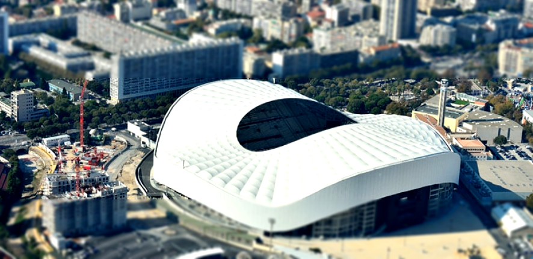

# tilt-shift-rust
I decided to learn Rust by using the library [Image](https://github.com/PistonDevelopers/image) and implement a [tilt-shift](https://en.wikipedia.org/wiki/Tilt%E2%80%93shift_photography) algorithm.

## Example 

### Original 


### After tilt shift


### Original 


### After tilt shift


## Compile 
`cargo build`

## Execute
```
cargo run  -- -b blur_level  -c saturation_level  -f filename_source -o filename_target -y originOfTheZoneOfTheInterest -h heightOfTheZoneOfTheInterest
#example
cargo run  -- -b 10.0  -c 20.0  -f "test.png" -o "result.png" -y 100 -h 50 -of "myFolder"

cargo run  -- -b 2  -c 10  -f "velodrome.jpg" -o "velodromeTiltShift.png" -y 100 -h 200

```

## Help
`cargo run -- -h`
